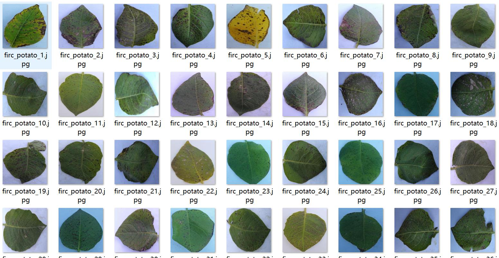
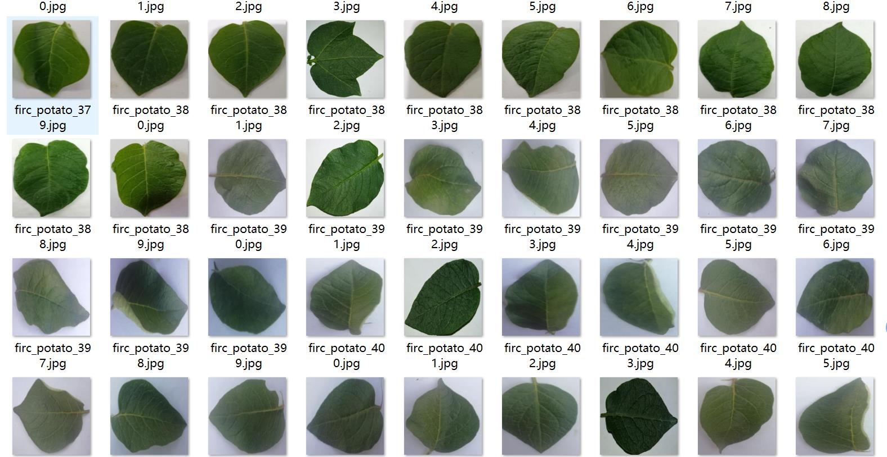
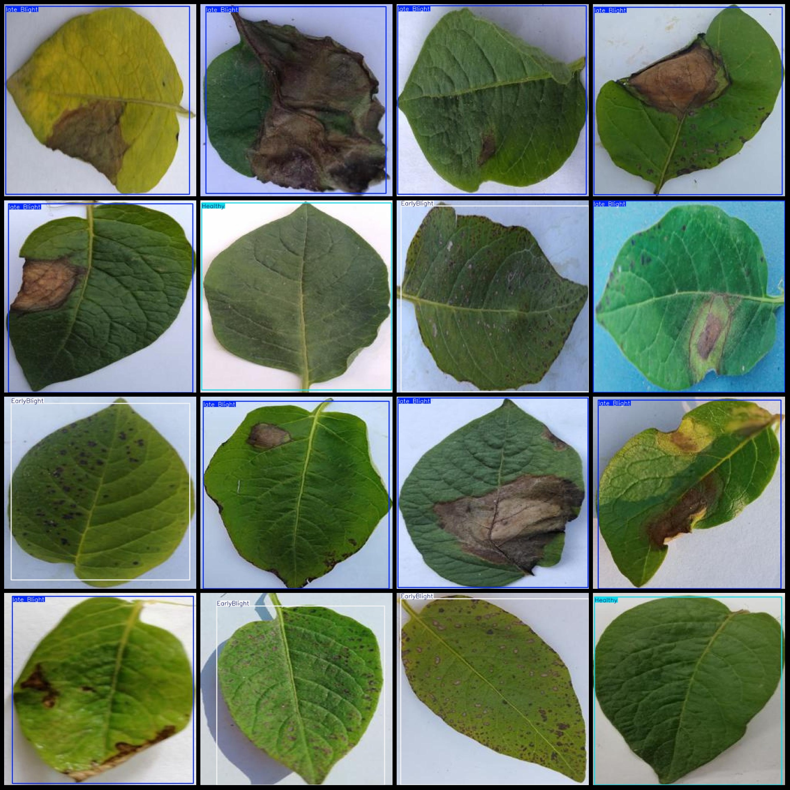
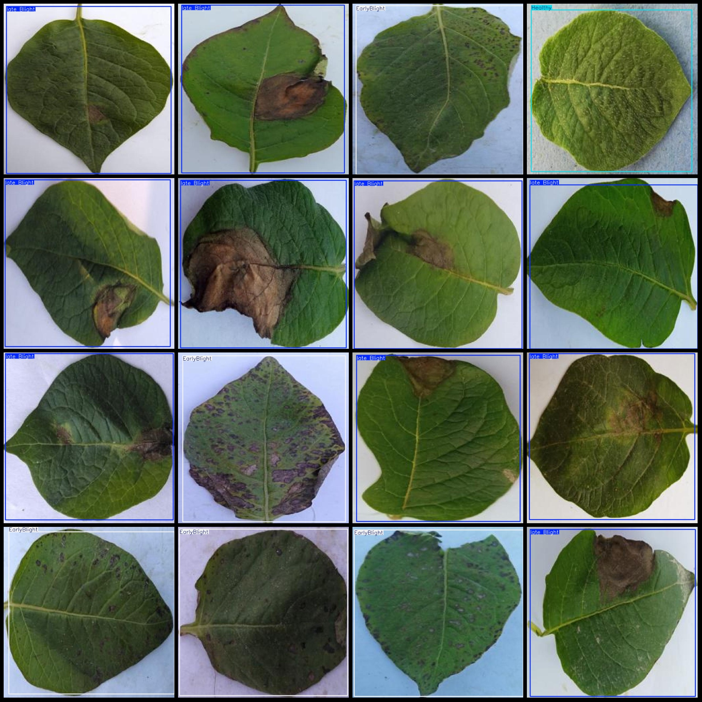

# Agricultural Intelligent Potato Leaves Disease Detection Dataset - VOC+YOLO with 1774 Images in 3 Categories for Single Leaf

The dataset format is Pascal VOC format + YOLO format (without split paths in the txt file, only containing jpg images and corresponding VOC format xml files and yolo format txt files). 
There are 1774 jpg file counts. 
There are 1774 xml file counts. 
There are 1774 txt file counts. 
The number of categories: 3. 
The category names of the labeled files (note that the order of categories in the yolo format is different from this, and should be based on the labels folder's classes.txt): ["EarlyBlight", 
"Healthy", "late Blight"]. 
Each category has a box count: 
"EarlyBlight" (early blight) = 256 
"Healthy" (healthy) = 561 
"late Blight" (late blight) = 984 
Total box count: 1801. 
Each category occupies a certain number of pictures: 
"EarlyBlight" (early blight) occupies 250 pictures. 
"Healthy" (healthy) occupies 558 pictures. 
"late Blight" (late blight) occupies 966 pictures. 
Image resolution: 640x640. 
Labeling tool used: labelImg. 
Labeling rules: draw boxes around the categories. 
Important note: The dataset does not have been divided into training, validation, or test sets, so it needs to be divided by yourself. 
Special declaration: This dataset does not guarantee the accuracy of the trained models or weight files. 
Image preview:
Image

Here is a pay link on Stripe ( https://buy.stripe.com/3cs8yP7sY87d0vu9AB ). Please contact me lonlonago@foxmail.com after funding $89, and I will send you a complete data files , thank you!

